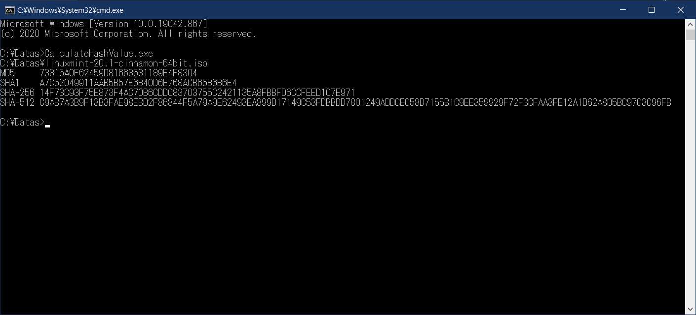

## 開発環境 Development Environment
- Windows 10 Home 64bit  
- Visual Studio 2019  
- Visual C++ (MFC : not used.)  

## ライセンス License
- MIT License  

## テストサンプルファイル sample file
- Linux Mint 20.1 "Ulyssa" - Cinnamon (64-bit) ISO  
> 14f73c93f75e873f4ac70b6cddc83703755c2421135a8fbbfd6ccfeed107e971 *linuxmint-20.1-cinnamon-64bit.iso

## 実行サンプル Sample Image

